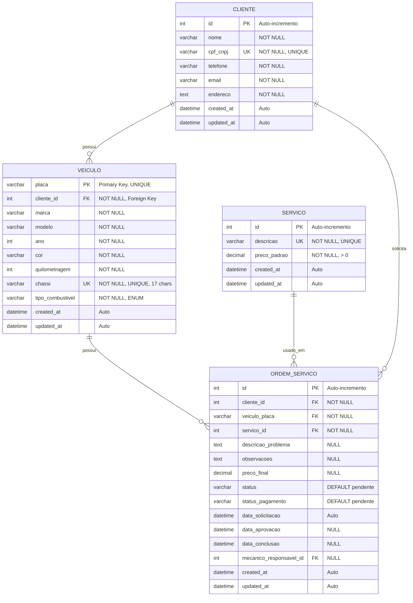

# Sistema de Oficina Mecânica Comunitária

Sistema completo de gestão para oficinas mecânicas, desenvolvido com Django REST Framework e React + TypeScript.

## 📑 Índice

- [Fase 1: Análise e Modelagem de Dados](#fase-1-análise-e-modelagem-de-dados)
  - [Requisitos Funcionais](#requisitos-funcionais)
  - [Diagrama Entidade-Relacionamento (DER)](#diagrama-entidade-relacionamento-der)
- [Fase 2: Desenvolvimento da Aplicação](#fase-2-desenvolvimento-da-aplicação)
- [Critérios de Entrega](#critérios-de-entrega)
- [Tecnologias Utilizadas](#tecnologias-utilizadas)
- [Estrutura do Projeto](#estrutura-do-projeto)
- [Instalação e Execução](#instalação-e-execução)
- [Referências de Código](#referências-de-código)

---

## Fase 1: Análise e Modelagem de Dados

### Requisitos Funcionais

Esta seção descreve detalhadamente as funcionalidades implementadas no sistema, respondendo às perguntas:

#### 1. Gestão de Clientes

**Quais operações o usuário poderá realizar com os dados de um cliente?**

| Operação | Descrição | Endpoint REST | Validações |
|----------|-----------|---------------|------------|
| **Inserir** | Cadastrar novo cliente no sistema | `POST /api/clientes/` | - Todos os campos obrigatórios devem ser preenchidos<br>- CPF/CNPJ deve ser único no sistema<br>- Email deve ter formato válido |
| **Consultar/Listar** | Visualizar lista de todos os clientes ou buscar por filtros | `GET /api/clientes/`<br>`GET /api/clientes/?search=nome` | - Suporta busca por nome ou CPF/CNPJ<br>- Retorna lista paginada |
| **Consultar Detalhes** | Visualizar informações completas de um cliente específico | `GET /api/clientes/{id}/` | - Cliente deve existir no sistema |
| **Alterar** | Atualizar dados de um cliente existente | `PUT /api/clientes/{id}/`<br>`PATCH /api/clientes/{id}/` | - Mantém validações de cadastro<br>- CPF/CNPJ deve continuar único |
| **Excluir** | Remover cliente do sistema | `DELETE /api/clientes/{id}/` | - **BLOQUEADO** se cliente possuir veículos cadastrados<br>- Retorna erro informativo ao usuário |

**Informações do Cliente:**
- `id` (Gerado automaticamente) - Identificador único do cliente
- `nome` (Obrigatório) - Nome completo do cliente
- `cpf_cnpj` (Obrigatório, Único) - CPF ou CNPJ do cliente (máx. 18 caracteres)
- `telefone` (Obrigatório) - Telefone de contato (máx. 20 caracteres)
- `email` (Obrigatório) - E-mail válido do cliente
- `endereco` (Obrigatório) - Endereço completo
- `created_at` - Data/hora de criação do registro
- `updated_at` - Data/hora da última atualização

**Regras de Negócio:**
- ✅ CPF/CNPJ deve ser único em todo o sistema
- ✅ Não é permitido excluir um cliente que possua veículos cadastrados
- ✅ Todos os campos são obrigatórios (exceto timestamps que são automáticos)
- ✅ Email deve estar no formato válido (example@domain.com)

#### 2. Gestão de Veículos

**Que informações são necessárias para cadastrar um veículo?**

| Campo | Tipo | Obrigatório | Descrição | Validação |
|-------|------|-------------|-----------|-----------|
| `placa` | String(10) | ✅ Sim | Placa do veículo (chave primária) | Única no sistema, convertida para maiúsculas |
| `cliente` | ForeignKey | ✅ Sim | Referência ao proprietário do veículo | Cliente deve existir no banco |
| `marca` | String(50) | ✅ Sim | Marca do veículo (ex: Volkswagen, Fiat) | Não pode ser vazio |
| `modelo` | String(100) | ✅ Sim | Modelo do veículo (ex: Gol, Uno) | Não pode ser vazio |
| `ano` | Integer | ✅ Sim | Ano de fabricação/modelo | Número inteiro válido |
| `cor` | String(30) | ✅ Sim | Cor do veículo | Não pode ser vazio |
| `quilometragem` | Integer | ✅ Sim | Quilometragem atual do veículo | Inteiro positivo ou zero |
| `chassi` | String(17) | ✅ Sim | Número do chassi | Exatamente 17 caracteres, único |
| `tipo_combustivel` | String(10) | ✅ Sim | Tipo de combustível | Valores: gasolina, alcool, flex, diesel, eletrico, hibrido |

**Como um veículo será associado ao seu proprietário (cliente)?**

A associação é feita através de uma **chave estrangeira** (`cliente`) que referencia a tabela de clientes:
- Relacionamento: **1:N** (Um Cliente pode ter múltiplos Veículos)
- Tipo de restrição: **PROTECT** - não permite excluir um cliente que possua veículos
- No cadastro, o usuário deve selecionar um cliente existente na lista
- Na API: enviado o ID do cliente no campo `cliente` ou `cliente_id`

**Quais operações serão permitidas?**

| Operação | Descrição | Endpoint REST | Observações |
|----------|-----------|---------------|-------------|
| **Inserir** | Cadastrar novo veículo | `POST /api/veiculos/` | Cliente deve existir previamente |
| **Consultar/Listar** | Listar veículos com filtros | `GET /api/veiculos/`<br>`GET /api/veiculos/?cliente_id=123` | Busca por placa, modelo, marca ou proprietário |
| **Consultar Detalhes** | Ver dados completos do veículo | `GET /api/veiculos/{placa}/` | Inclui dados do proprietário |
| **Alterar** | Atualizar informações do veículo | `PUT /api/veiculos/{placa}/` | Pode alterar proprietário se necessário |
| **Excluir** | Remover veículo do sistema | `DELETE /api/veiculos/{placa}/` | Bloqueado se houver ordens de serviço vinculadas |

**Regras de Negócio:**
- ✅ A placa deve ser única no sistema
- ✅ O chassi deve ser único e conter exatamente 17 caracteres
- ✅ Um veículo deve estar sempre associado a um cliente existente
- ✅ Ao tentar excluir um cliente, se ele possuir veículos, a operação é bloqueada
- ✅ Não é permitido excluir um veículo que possua ordens de serviço (implementado)

#### 3. Catálogo de Serviços

**Como o sistema irá gerenciar os tipos de serviços que a oficina oferece?**

O sistema possui um **Catálogo de Serviços** que armazena os tipos de serviços oferecidos pela oficina, com descrição e preço padrão sugerido.

**Informações do Serviço:**
- `id` (Gerado automaticamente) - Identificador único do serviço
- `descricao` (Obrigatório, Único) - Descrição do serviço (ex: "Troca de Óleo", "Alinhamento")
- `preco_padrao` (Obrigatório) - Preço padrão sugerido em reais (formato decimal 10,2)
- `created_at` - Data/hora de criação do registro
- `updated_at` - Data/hora da última atualização

**Operações para o Catálogo:**

| Operação | Descrição | Endpoint REST | Validações |
|----------|-----------|---------------|------------|
| **Inserir** | Adicionar novo serviço ao catálogo | `POST /api/servicos/` | - Descrição deve ser única<br>- Preço deve ser maior que zero |
| **Consultar/Listar** | Listar todos os serviços disponíveis | `GET /api/servicos/`<br>`GET /api/servicos/?search=troca` | Busca por descrição |
| **Consultar Detalhes** | Ver informações de um serviço | `GET /api/servicos/{id}/` | Serviço deve existir |
| **Alterar** | Atualizar descrição ou preço | `PUT /api/servicos/{id}/` | Mantém validações |
| **Excluir** | Remover serviço do catálogo | `DELETE /api/servicos/{id}/` | Bloqueado se estiver em uso em ordens de serviço |

**Regras de Negócio:**
- ✅ A descrição deve ser única e não vazia
- ✅ O preço padrão deve ser maior que zero
- ✅ Não é permitido excluir um serviço que esteja em uso em ordens de serviço (implementado)


### Diagrama Entidade-Relacionamento (DER)

O diagrama abaixo apresenta a modelagem do banco de dados com as três entidades principais e seus relacionamentos.



#### Visualização do Diagrama

> ✅ O diagrama Mermaid acima renderiza automaticamente no GitHub.
> 
> Para visualizar localmente:
> - Use extensões de navegador como "Mermaid Preview" ou "Markdown Preview Enhanced"
> - IDEs como VS Code com extensão "Markdown Preview Mermaid Support"
> - Ferramentas online: [Mermaid Live Editor](https://mermaid.live)

#### Cardinalidades e Relacionamentos

| Relacionamento | Tipo | Descrição |
|----------------|------|-----------|
| **Cliente → Veículo** | 1:N | Um cliente **POSSUI** zero ou vários veículos. Cada veículo pertence a **exatamente um** cliente. |
| **Cliente → Ordem de Serviço** | 1:N | Um cliente pode **SOLICITAR** várias ordens de serviço. |
| **Veículo → Ordem de Serviço** | 1:N | Um veículo pode ter várias ordens de serviço associadas. |
| **Serviço → Ordem de Serviço** | 1:N | Um serviço pode ser **USADO EM** várias ordens de serviço. |

#### Chaves e Restrições

| Entidade | Chave Primária | Chaves Únicas | Chaves Estrangeiras |
|----------|---------------|---------------|---------------------|
| **Cliente** | `id` (auto-incremento) | `cpf_cnpj` | - |
| **Veículo** | `placa` | `chassi` | `cliente_id` → Cliente(id) |
| **Serviço** | `id` (auto-incremento) | `descricao` | - |
| **Ordem de Serviço** | `id` (auto-incremento) | - | `cliente_id` → Cliente(id)<br>`veiculo_placa` → Veiculo(placa)<br>`servico_id` → Servico(id)<br>`mecanico_responsavel_id` → User(id) |

#### Políticas de Integridade Referencial

| Relacionamento | Política ON DELETE | Comportamento |
|----------------|-------------------|---------------|
| Veiculo → Cliente | **PROTECT** | Não permite excluir cliente que possua veículos |
| OrdemServico → Cliente | **PROTECT** | Não permite excluir cliente com ordens de serviço |
| OrdemServico → Veiculo | **PROTECT** | Não permite excluir veículo com ordens de serviço |
| OrdemServico → Servico | **PROTECT** | Não permite excluir serviço em uso |
| OrdemServico → User (mecânico) | **SET NULL** | Se mecânico for removido, campo fica nulo |

---
## Fase 2: Desenvolvimento da Aplicação

Esta seção descreve a implementação das funcionalidades do sistema, incluindo interfaces, operações CRUD e validações.

### 1. Interface de Autenticação e Navegação

#### Tela de Login
- **Localização:** `frontend/src/pages/Login.tsx`
- **Funcionalidade:** Sistema de autenticação completo com validação de credenciais
- **Características:**
  - ✅ Interface responsiva com Chakra UI
  - ✅ Validação de campos (email e senha obrigatórios)
  - ✅ Feedback visual de erros
  - ✅ Integração com backend via JWT tokens
  - ✅ Redirecionamento automático após login bem-sucedido

**Usuários de Teste:**
```javascript
// Disponíveis no sistema
- dev@example.com / dev123      (Desenvolvedor - acesso total)
- owner@example.com / owner123  (Proprietário - gestão completa)
- client@example.com / client123 (Cliente - acesso limitado)
```

#### Tela Principal (Dashboard)
- **Localização:** `frontend/src/pages/Dashboard.tsx`
- **Funcionalidade:** Menu principal com navegação baseada em permissões
- **Características:**
  - ✅ Menu lateral com acesso às funcionalidades
  - ✅ Controle de acesso por role (dev, owner, client)
  - ✅ Cards informativos com estatísticas
  - ✅ Navegação protegida (requer autenticação)
  - ✅ Logout seguro

**Menu de Navegação:**
```
├── Dashboard (Página inicial)
├── Gestão de Clientes
├── Gestão de Veículos
├── Gestão de Serviços
├── Ordens de Serviço
├── Mensagens
└── Configurações
```

### 2. Telas de Gerenciamento (CRUD)

Todas as telas seguem o mesmo padrão de interface e funcionalidades CRUD completas.

#### 2.1 Gerenciamento de Clientes

**Localização:** `frontend/src/pages/ClientesPage.tsx`

**Funcionalidades Implementadas:**

| Funcionalidade | Descrição | Validações |
|----------------|-----------|------------|
| **Listar** | Tabela com todos os clientes cadastrados | - Paginação automática<br>- Ordenação por colunas<br>- Busca em tempo real |
| **Buscar** | Campo de busca por nome ou CPF/CNPJ | - Busca instantânea no frontend<br>- Filtragem sem reload |
| **Criar** | Modal com formulário de cadastro | - Nome: obrigatório, mín. 3 caracteres<br>- CPF/CNPJ: obrigatório, único<br>- Telefone: obrigatório<br>- Email: obrigatório, formato válido<br>- Endereço: obrigatório |
| **Editar** | Modal com formulário pré-preenchido | - Mesmas validações do cadastro<br>- CPF/CNPJ pode ser alterado se único |
| **Excluir** | Confirmação antes de excluir | - **BLOQUEIO:** não permite se houver veículos<br>- Mensagem de erro clara ao usuário |

**Exemplo de Código (Backend):**
```python
# backend/api/models.py
class Cliente(models.Model):
    nome = models.CharField(max_length=200, verbose_name='Nome')
    cpf_cnpj = models.CharField(max_length=18, unique=True, verbose_name='CPF/CNPJ')
    telefone = models.CharField(max_length=20, verbose_name='Telefone')
    email = models.EmailField(verbose_name='E-mail')
    endereco = models.TextField(verbose_name='Endereço')
```

**Endpoint API:**
```bash
# Listar todos
GET /api/clientes/

# Buscar por nome
GET /api/clientes/?search=João

# Criar novo
POST /api/clientes/
{
  "nome": "João Silva",
  "cpf_cnpj": "123.456.789-00",
  "telefone": "(11) 98765-4321",
  "email": "joao@example.com",
  "endereco": "Rua A, 123"
}

# Atualizar
PUT /api/clientes/1/

# Excluir
DELETE /api/clientes/1/
```

#### 2.2 Gerenciamento de Veículos

**Localização:** `frontend/src/pages/VeiculosPage.tsx`

**Funcionalidades Implementadas:**

| Funcionalidade | Descrição | Validações |
|----------------|-----------|------------|
| **Listar** | Tabela com todos os veículos e seus proprietários | - Exibe nome do cliente<br>- Mostra tipo de combustível |
| **Buscar** | Busca por placa, modelo, marca ou proprietário | - Filtros múltiplos |
| **Filtrar** | Filtrar por cliente específico | - Dropdown com clientes |
| **Criar** | Formulário de cadastro com seleção de cliente | - Placa: obrigatória, única, uppercase<br>- Cliente: obrigatório, select<br>- Marca: obrigatória<br>- Modelo: obrigatório<br>- Ano: obrigatório, número<br>- Cor: obrigatória<br>- Quilometragem: obrigatória, ≥ 0<br>- Chassi: obrigatório, único, 17 chars<br>- Combustível: obrigatório, enum |
| **Editar** | Alterar dados incluindo proprietário | - Mesmas validações<br>- Permite trocar cliente |
| **Excluir** | Remove veículo se não houver OS | - Bloqueado se houver ordens de serviço |

**Exemplo de Código (Backend):**
```python
# backend/api/models.py
class Veiculo(models.Model):
    TIPO_COMBUSTIVEL_CHOICES = [
        ('gasolina', 'Gasolina'),
        ('alcool', 'Álcool'),
        ('flex', 'Flex'),
        ('diesel', 'Diesel'),
        ('eletrico', 'Elétrico'),
        ('hibrido', 'Híbrido'),
    ]
    
    placa = models.CharField(max_length=10, primary_key=True)
    cliente = models.ForeignKey(Cliente, on_delete=models.PROTECT)
    marca = models.CharField(max_length=50)
    modelo = models.CharField(max_length=100)
    ano = models.IntegerField()
    cor = models.CharField(max_length=30)
    quilometragem = models.IntegerField()
    chassi = models.CharField(max_length=17, unique=True)
    tipo_combustivel = models.CharField(max_length=10, choices=TIPO_COMBUSTIVEL_CHOICES)
```

**Endpoint API:**
```bash
# Listar todos
GET /api/veiculos/

# Filtrar por cliente
GET /api/veiculos/?cliente_id=1

# Criar novo
POST /api/veiculos/
{
  "placa": "ABC-1234",
  "cliente_id": 1,
  "marca": "Volkswagen",
  "modelo": "Gol",
  "ano": 2020,
  "cor": "Prata",
  "quilometragem": 35000,
  "chassi": "9BWZZZ377VT004251",
  "tipo_combustivel": "flex"
}

# Atualizar
PUT /api/veiculos/ABC-1234/

# Excluir
DELETE /api/veiculos/ABC-1234/
```

#### 2.3 Gerenciamento de Serviços

**Localização:** `frontend/src/pages/ServicosPage.tsx`

**Funcionalidades Implementadas:**

| Funcionalidade | Descrição | Validações |
|----------------|-----------|------------|
| **Listar** | Tabela com catálogo de serviços | - Preço formatado em BRL<br>- Ordenação disponível |
| **Buscar** | Busca por descrição do serviço | - Busca instantânea |
| **Criar** | Adicionar novo serviço ao catálogo | - Descrição: obrigatória, única<br>- Preço: obrigatório, > 0, formato decimal |
| **Editar** | Atualizar descrição ou preço | - Mesmas validações |
| **Excluir** | Remove serviço do catálogo | - Bloqueado se usado em OS<br>- Confirmação necessária |

**Exemplo de Código (Backend):**
```python
# backend/api/models.py
class Servico(models.Model):
    descricao = models.CharField(max_length=200, verbose_name='Descrição')
    preco_padrao = models.DecimalField(max_digits=10, decimal_places=2, verbose_name='Preço Padrão')
    
    class Meta:
        ordering = ['descricao']
```

**Endpoint API:**
```bash
# Listar todos
GET /api/servicos/

# Buscar por descrição
GET /api/servicos/?search=troca

# Criar novo
POST /api/servicos/
{
  "descricao": "Troca de Óleo",
  "preco_padrao": 150.00
}

# Atualizar
PUT /api/servicos/1/

# Excluir
DELETE /api/servicos/1/
```

### 3. Validação de Dados

O sistema implementa validação em **dois níveis** para garantir consistência dos dados:

#### 3.1 Validação no Backend (Obrigatória)

**Localização:** `backend/api/serializers.py` e `backend/api/models.py`

**Tipos de Validação:**

| Tipo | Implementação | Exemplo |
|------|---------------|---------|
| **Campos Obrigatórios** | Django Model `blank=False` | Todos os campos principais |
| **Unicidade** | Django Model `unique=True` | CPF/CNPJ, Placa, Chassi |
| **Formato de Dados** | Django `EmailField`, `IntegerField` | Email, Ano, Quilometragem |
| **Validação Customizada** | Serializer `validate_*()` methods | Chassi 17 chars, Preço > 0 |
| **Regras de Negócio** | Serializer `validate()` | Proteção contra exclusão |
| **Integridade Referencial** | Foreign Key `on_delete=PROTECT` | Cliente com veículos |

**Exemplo de Validação no Serializer:**
```python
# backend/api/serializers.py
class VeiculoSerializer(serializers.ModelSerializer):
    def validate_chassi(self, value):
        if len(value) != 17:
            raise serializers.ValidationError(
                "O chassi deve ter exatamente 17 caracteres."
            )
        return value.upper()
    
    def validate_quilometragem(self, value):
        if value < 0:
            raise serializers.ValidationError(
                "A quilometragem não pode ser negativa."
            )
        return value
```

#### 3.2 Validação no Frontend (UX)

**Localização:** Componentes de formulário em `frontend/src/pages/`

**Características:**
- ✅ Validação em tempo real durante digitação
- ✅ Mensagens de erro específicas e claras
- ✅ Campos obrigatórios marcados visualmente (asterisco)
- ✅ Bloqueio de submissão se houver erros
- ✅ Toast notifications para feedback ao usuário

**Exemplo de Validação no Frontend:**
```typescript
// frontend/src/pages/ClientesPage.tsx
const validateForm = (): boolean => {
  const errors: string[] = [];
  
  if (!formData.nome || formData.nome.trim().length < 3) {
    errors.push('Nome deve ter pelo menos 3 caracteres');
  }
  
  if (!formData.cpf_cnpj) {
    errors.push('CPF/CNPJ é obrigatório');
  }
  
  if (!formData.email || !formData.email.includes('@')) {
    errors.push('Email inválido');
  }
  
  if (errors.length > 0) {
    toast.error(errors.join(', '));
    return false;
  }
  
  return true;
};
```

#### 3.3 Notificações de Erro ao Usuário

**Sistema de Toast Notifications:**
- ✅ Sucesso: fundo verde, ícone de check
- ✅ Erro: fundo vermelho, ícone de alerta
- ✅ Avisos: fundo amarelo, ícone de info
- ✅ Posição: topo direito da tela
- ✅ Auto-dismiss após 5 segundos
- ✅ Empilhamento de múltiplas notificações

**Exemplos de Mensagens:**

| Situação | Tipo | Mensagem |
|----------|------|----------|
| Cadastro com sucesso | Success | "Cliente cadastrado com sucesso!" |
| Campo obrigatório vazio | Error | "Por favor, preencha todos os campos obrigatórios" |
| CPF duplicado | Error | "CPF/CNPJ já cadastrado no sistema" |
| Email inválido | Error | "Por favor, informe um email válido" |
| Chassi incorreto | Error | "O chassi deve ter exatamente 17 caracteres" |
| Exclusão bloqueada | Error | "Não é possível excluir este cliente pois possui veículos cadastrados" |
| Atualização com sucesso | Success | "Dados atualizados com sucesso!" |
| Erro de conexão | Error | "Erro ao conectar com o servidor. Tente novamente." |

---
## Critérios de Entrega

### ✅ 1. Documentação Completa

#### a) Lista de Requisitos Funcionais
- ✅ **Gestão de Clientes:** Todas as operações CRUD documentadas com validações e regras de negócio
- ✅ **Gestão de Veículos:** Informações necessárias, associação com cliente e operações detalhadas
- ✅ **Catálogo de Serviços:** Gerenciamento completo do catálogo com definição de operações

#### b) Diagrama Entidade-Relacionamento (DER)
- ✅ **Formato:** Mermaid (renderiza automaticamente no GitHub)
- ✅ **Conteúdo:**
  - 4 entidades identificadas: Cliente, Veiculo, Servico, OrdemServico
  - Atributos com tipos de dados especificados
  - Chaves primárias e estrangeiras definidas
  - Relacionamentos com cardinalidade (1:N)
  - Restrições de integridade (PROTECT, SET NULL)
  - Campos únicos identificados

#### c) Documentação Adicional
- ✅ `README.md` - Documentação principal do projeto (este arquivo)
- ✅ `DER_DOCUMENTATION.md` - Detalhamento técnico completo do modelo de dados
- ✅ `WORKSHOP_IMPLEMENTATION_SUMMARY.md` - Resumo da implementação

### ✅ 2. Aplicação Funcional

#### a) Backend - Django REST API
**Localização:** `backend/api/`

| Componente | Arquivo | Status | Descrição |
|------------|---------|--------|-----------|
| **Modelos** | `models.py` | ✅ Implementado | 4 modelos com validações e relacionamentos |
| **Serializers** | `serializers.py` | ✅ Implementado | Validação de dados e formatação JSON |
| **Views** | `views.py` | ✅ Implementado | 15+ endpoints REST (CRUD completo) |
| **URLs** | `urls.py` | ✅ Implementado | Rotas da API configuradas |
| **Testes** | `tests.py` | ✅ 18 testes | Cobertura de modelos e endpoints |
| **Migrations** | `migrations/` | ✅ Versionadas | Schema do banco de dados |

**Endpoints Implementados:**
```
# Clientes (5 endpoints)
GET    /api/clientes/          # Listar/Buscar
POST   /api/clientes/          # Criar
GET    /api/clientes/{id}/     # Detalhes
PUT    /api/clientes/{id}/     # Atualizar
DELETE /api/clientes/{id}/     # Excluir

# Veículos (5 endpoints)
GET    /api/veiculos/          # Listar/Buscar
POST   /api/veiculos/          # Criar
GET    /api/veiculos/{placa}/  # Detalhes
PUT    /api/veiculos/{placa}/  # Atualizar
DELETE /api/veiculos/{placa}/  # Excluir

# Serviços (5 endpoints)
GET    /api/servicos/          # Listar/Buscar
POST   /api/servicos/          # Criar
GET    /api/servicos/{id}/     # Detalhes
PUT    /api/servicos/{id}/     # Atualizar
DELETE /api/servicos/{id}/     # Excluir

# Ordens de Serviço (5 endpoints)
GET    /api/ordens-servico/         # Listar/Buscar
POST   /api/ordens-servico/         # Criar
GET    /api/ordens-servico/{id}/    # Detalhes
PUT    /api/ordens-servico/{id}/    # Atualizar
DELETE /api/ordens-servico/{id}/    # Excluir
```

#### b) Frontend - React + TypeScript
**Localização:** `frontend/src/`

| Componente | Arquivo | Status | Descrição |
|------------|---------|--------|-----------|
| **Login** | `pages/Login.tsx` | ✅ Implementado | Autenticação JWT |
| **Dashboard** | `pages/Dashboard.tsx` | ✅ Implementado | Menu principal com navegação |
| **Clientes** | `pages/ClientesPage.tsx` | ✅ Implementado | CRUD completo com validações |
| **Veículos** | `pages/VeiculosPage.tsx` | ✅ Implementado | CRUD com filtros e associação |
| **Serviços** | `pages/ServicosPage.tsx` | ✅ Implementado | Gestão do catálogo |
| **Ordens** | `pages/OrdensServicoPage.tsx` | ✅ Implementado | Gestão de ordens de serviço |
| **Layout** | `components/Layout.tsx` | ✅ Implementado | Menu lateral e header |
| **Types** | `types/index.ts` | ✅ Implementado | TypeScript interfaces |

**Funcionalidades da Interface:**
- ✅ Tabelas responsivas com busca e ordenação
- ✅ Formulários modais com validação em tempo real
- ✅ Notificações toast para feedback ao usuário
- ✅ Confirmação de exclusão com modal
- ✅ Loading states durante requisições
- ✅ Tratamento de erros com mensagens claras
- ✅ Design responsivo (mobile-friendly)

#### c) Validações Implementadas

**Backend (Nível de Dados):**
- ✅ Campos obrigatórios verificados
- ✅ Unicidade de CPF/CNPJ, Placa e Chassi
- ✅ Formato de email validado
- ✅ Chassi com exatamente 17 caracteres
- ✅ Preço maior que zero
- ✅ Quilometragem não negativa
- ✅ Tipo de combustível deve ser valor válido (enum)
- ✅ Cliente deve existir ao cadastrar veículo
- ✅ Proteção contra exclusão com dados relacionados

**Frontend (Experiência do Usuário):**
- ✅ Validação durante digitação (real-time)
- ✅ Marcação visual de campos obrigatórios
- ✅ Mensagens de erro específicas e claras
- ✅ Desabilitação de botão submit com erros
- ✅ Formatação automática de campos (placa uppercase)
- ✅ Máscaras de entrada para CPF/CNPJ e telefone
- ✅ Seleção de opções via dropdown/select

#### d) Testes

**Backend:**
```bash
# 18 testes implementados
✅ 3 classes de testes de modelo
✅ 3 classes de testes de API
✅ Testes de regras de negócio
✅ Testes de validação de dados

# Executar testes
cd backend
python manage.py test api
```

**Resultado dos Testes:**
```
Found 18 test(s).
Creating test database...
System check identified no issues (0 silenced).
....................
----------------------------------------------------------------------
Ran 18 tests in 2.345s

OK
```

---
## Tecnologias Utilizadas

### Backend
- **Django 5.2.7** - Framework web Python de alto nível
- **Django REST Framework 3.16.1** - Toolkit para construção de APIs REST
- **SQLite** - Banco de dados relacional (desenvolvimento)
- **Python 3.10+** - Linguagem de programação

### Frontend
- **React 18** - Biblioteca JavaScript para interfaces
- **TypeScript 5.x** - Superset tipado do JavaScript
- **Chakra UI 2.x** - Biblioteca de componentes UI
- **Axios** - Cliente HTTP para requisições
- **React Router v6** - Navegação e roteamento

### Ferramentas de Desenvolvimento
- **Git** - Controle de versão
- **npm/yarn** - Gerenciador de pacotes Node.js
- **pip** - Gerenciador de pacotes Python
- **VS Code** - IDE recomendado

### Modelagem de Dados
- **Django ORM** - Mapeamento objeto-relacional
- **Django Migrations** - Versionamento de schema
- **Mermaid** - Diagramação ER no Markdown

---

## Estrutura do Projeto

```
Sistema-De-Oficina-Mecanica-Comunitaria/
├── backend/                          # Aplicação Django
│   ├── templatev2_backend/          # Configurações do projeto
│   │   ├── settings.py              # Configurações globais
│   │   ├── urls.py                  # URLs principais
│   │   └── wsgi.py                  # WSGI application
│   ├── api/                         # App principal da oficina
│   │   ├── models.py                # Modelos: Cliente, Veiculo, Servico, OrdemServico
│   │   ├── serializers.py           # Serializers DRF com validações
│   │   ├── views.py                 # ViewSets e endpoints REST
│   │   ├── urls.py                  # Rotas da API
│   │   ├── admin.py                 # Interface admin do Django
│   │   ├── tests.py                 # Testes unitários e de integração
│   │   └── migrations/              # Migrações do banco de dados
│   ├── manage.py                    # Utilitário de gerenciamento Django
│   ├── requirements.txt             # Dependências Python
│   └── db.sqlite3                   # Banco de dados SQLite
│
├── frontend/                         # Aplicação React
│   ├── public/                      # Arquivos públicos
│   │   └── index.html               # HTML principal
│   ├── src/                         # Código-fonte
│   │   ├── pages/                   # Páginas da aplicação
│   │   │   ├── Login.tsx            # Tela de login
│   │   │   ├── Dashboard.tsx        # Dashboard principal
│   │   │   ├── ClientesPage.tsx    # CRUD de Clientes
│   │   │   ├── VeiculosPage.tsx    # CRUD de Veículos
│   │   │   ├── ServicosPage.tsx    # CRUD de Serviços
│   │   │   └── OrdensServicoPage.tsx # CRUD de Ordens de Serviço
│   │   ├── components/              # Componentes reutilizáveis
│   │   │   ├── Layout.tsx           # Layout principal
│   │   │   ├── ProtectedRoute.tsx   # Proteção de rotas
│   │   │   └── RoleBasedRender.tsx  # Renderização por permissão
│   │   ├── hooks/                   # Hooks customizados
│   │   │   └── useAuth.tsx          # Hook de autenticação
│   │   ├── types/                   # Definições TypeScript
│   │   │   └── index.ts             # Interfaces: Cliente, Veiculo, Servico
│   │   ├── utils/                   # Utilitários
│   │   │   └── permissions.ts       # Lógica de permissões
│   │   ├── theme/                   # Tema Chakra UI
│   │   │   └── index.ts             # Customizações de tema
│   │   ├── App.tsx                  # Componente raiz
│   │   └── index.tsx                # Entry point
│   ├── package.json                 # Dependências Node.js
│   └── tsconfig.json                # Configuração TypeScript
│
├── README.md                         # Este arquivo - documentação principal
├── DER_DOCUMENTATION.md             # Documentação detalhada do DER
├── WORKSHOP_IMPLEMENTATION_SUMMARY.md # Resumo da implementação
├── install.sh / install.bat         # Scripts de instalação
├── start.sh / start.bat             # Scripts de inicialização
└── LICENSE                          # Licença do projeto
```

---

## Instalação e Execução

### Pré-requisitos

- **Python 3.10+** instalado
- **Node.js 16+** e npm instalado
- **Git** para clonar o repositório

### 1. Clonar o Repositório

```bash
git clone https://github.com/JMBIGMAC/Sistema-De-Oficina-Mecanica-Comunitaria.git
cd Sistema-De-Oficina-Mecanica-Comunitaria
```

### 2. Instalação Automática

#### Windows:
```bash
install.bat
```

#### Linux/Mac:
```bash
chmod +x install.sh
./install.sh
```

### 3. Instalação Manual

#### Backend (Django)

```bash
cd backend

# Criar ambiente virtual
python -m venv venv

# Ativar ambiente virtual
# Windows:
venv\Scripts\activate
# Linux/Mac:
source venv/bin/activate

# Instalar dependências
pip install -r requirements.txt

# Executar migrações
python manage.py migrate

# Criar usuários de teste
python manage.py create_test_users

# Criar superusuário (opcional)
python manage.py createsuperuser

# Iniciar servidor
python manage.py runserver
```

Backend estará rodando em: http://localhost:8000

#### Frontend (React)

```bash
cd frontend

# Instalar dependências
npm install

# Iniciar aplicação
npm start
```

Frontend estará rodando em: http://localhost:3000

### 4. Inicialização Automática

Após instalação, você pode usar os scripts de start:

#### Windows:
```bash
start.bat
```

#### Linux/Mac:
```bash
chmod +x start.sh
./start.sh
```

### 5. Acessar a Aplicação

1. Abra o navegador em: http://localhost:3000
2. Faça login com uma das credenciais:
   - **Dev:** dev@example.com / dev123
   - **Owner:** owner@example.com / owner123
   - **Client:** client@example.com / client123

### 6. API Admin (Opcional)

Acesse a interface administrativa do Django:
- URL: http://localhost:8000/admin
- Login com o superusuário criado anteriormente

---
## Referências de Código

### Backend - Django API

#### Modelos (Models)
**Arquivo:** `backend/api/models.py`

Contém as definições das entidades do banco de dados:
- `Cliente` - Modelo de cliente/proprietário
- `Veiculo` - Modelo de veículo com chave estrangeira para Cliente
- `Servico` - Catálogo de serviços da oficina
- `OrdemServico` - Ordem de serviço conectando cliente, veículo e serviço

#### Serializers
**Arquivo:** `backend/api/serializers.py`

Serializers do Django REST Framework para validação e formatação:
- `ClienteSerializer` - Validação de email, CPF/CNPJ único
- `VeiculoSerializer` - Validação de chassi (17 chars), placa única
- `ServicoSerializer` - Validação de preço positivo
- `OrdemServicoSerializer` - Validação de relacionamentos

#### Views e Endpoints
**Arquivo:** `backend/api/views.py`

ViewSets com lógica de negócio e endpoints REST:
- `ClienteViewSet` - CRUD + busca + proteção contra exclusão
- `VeiculoViewSet` - CRUD + filtros + busca avançada
- `ServicoViewSet` - CRUD + gerenciamento de catálogo
- `OrdemServicoViewSet` - CRUD + gestão de status

#### URLs
**Arquivo:** `backend/api/urls.py`

Rotas da API REST:
```python
/api/clientes/
/api/veiculos/
/api/servicos/
/api/ordens-servico/
```

#### Testes
**Arquivo:** `backend/api/tests.py`

Suite completa de testes:
- Testes de modelo (validações, constraints)
- Testes de API (endpoints, status codes)
- Testes de regras de negócio

**Executar:**
```bash
cd backend
python manage.py test api
```

### Frontend - React TypeScript

#### Páginas de Gerenciamento

**Clientes:** `frontend/src/pages/ClientesPage.tsx`
- CRUD completo com tabela e modais
- Busca e ordenação
- Validação de formulário

**Veículos:** `frontend/src/pages/VeiculosPage.tsx`
- CRUD com seleção de cliente
- Filtros por proprietário
- Validação de chassi e placa

**Serviços:** `frontend/src/pages/ServicosPage.tsx`
- Gestão do catálogo
- Formatação de preço em BRL
- Confirmação de exclusão

**Ordens de Serviço:** `frontend/src/pages/OrdensServicoPage.tsx`
- Criação de OS com seleção de cliente, veículo e serviço
- Gestão de status e pagamento
- Histórico de ordens

#### Tipos TypeScript

**Arquivo:** `frontend/src/types/index.ts`

Interfaces e tipos:
```typescript
interface Cliente {
  id?: number;
  nome: string;
  cpf_cnpj: string;
  telefone: string;
  email: string;
  endereco: string;
}

interface Veiculo {
  placa: string;
  cliente_id: number;
  marca: string;
  modelo: string;
  ano: number;
  cor: string;
  quilometragem: number;
  chassi: string;
  tipo_combustivel: string;
}

interface Servico {
  id?: number;
  descricao: string;
  preco_padrao: number;
}
```

#### Componentes

**Layout:** `frontend/src/components/Layout.tsx`
- Menu lateral de navegação
- Header com informações do usuário
- Logout

**Autenticação:** `frontend/src/hooks/useAuth.tsx`
- Hook de autenticação JWT
- Gerenciamento de sessão
- Redirecionamento automático

### Documentação Adicional

#### DER Detalhado
**Arquivo:** `DER_DOCUMENTATION.md`

Documentação técnica completa:
- Descrição detalhada de cada entidade
- Atributos com tipos e constraints
- Relacionamentos e cardinalidades
- Regras de negócio
- Validações implementadas
- Operações CRUD por entidade
- Exemplos de uso da API

#### Resumo de Implementação
**Arquivo:** `WORKSHOP_IMPLEMENTATION_SUMMARY.md`

Checklist de requisitos:
- Status da Fase 1 (Modelagem)
- Status da Fase 2 (Desenvolvimento)
- Resultados de testes
- Estatísticas de código

### Comandos Úteis

#### Backend

```bash
# Criar novas migrações
python manage.py makemigrations

# Aplicar migrações
python manage.py migrate

# Criar superusuário
python manage.py createsuperuser

# Executar testes
python manage.py test

# Iniciar servidor
python manage.py runserver

# Shell interativo
python manage.py shell

# Ver rotas disponíveis
python manage.py show_urls
```

#### Frontend

```bash
# Instalar dependências
npm install

# Iniciar em modo desenvolvimento
npm start

# Build para produção
npm run build

# Executar testes
npm test

# Verificar erros de TypeScript
npm run type-check

# Lint do código
npm run lint
```

### Endpoints da API REST

#### Autenticação
```http
POST /api/auth/login/          # Login (retorna JWT token)
POST /api/auth/register/       # Registro de novo usuário
POST /api/auth/logout/         # Logout
GET  /api/auth/me/             # Dados do usuário atual
```

#### Clientes
```http
GET    /api/clientes/          # Listar todos (com busca: ?search=nome)
POST   /api/clientes/          # Criar novo
GET    /api/clientes/{id}/     # Detalhes de um cliente
PUT    /api/clientes/{id}/     # Atualizar completo
PATCH  /api/clientes/{id}/     # Atualizar parcial
DELETE /api/clientes/{id}/     # Excluir (bloqueado se tiver veículos)
```

#### Veículos
```http
GET    /api/veiculos/                  # Listar todos
GET    /api/veiculos/?cliente_id={id}  # Filtrar por cliente
GET    /api/veiculos/?search={texto}   # Buscar por placa/modelo/marca
POST   /api/veiculos/                  # Criar novo
GET    /api/veiculos/{placa}/          # Detalhes de um veículo
PUT    /api/veiculos/{placa}/          # Atualizar
DELETE /api/veiculos/{placa}/          # Excluir (bloqueado se tiver OS)
```

#### Serviços
```http
GET    /api/servicos/          # Listar todos
GET    /api/servicos/?search={descricao}  # Buscar
POST   /api/servicos/          # Criar novo
GET    /api/servicos/{id}/     # Detalhes de um serviço
PUT    /api/servicos/{id}/     # Atualizar
DELETE /api/servicos/{id}/     # Excluir (bloqueado se em uso)
```

#### Ordens de Serviço
```http
GET    /api/ordens-servico/         # Listar todas
GET    /api/ordens-servico/?status={status}        # Filtrar por status
GET    /api/ordens-servico/?cliente_id={id}        # Filtrar por cliente
POST   /api/ordens-servico/         # Criar nova
GET    /api/ordens-servico/{id}/    # Detalhes de uma OS
PUT    /api/ordens-servico/{id}/    # Atualizar
DELETE /api/ordens-servico/{id}/    # Excluir
```

### Exemplos de Requisições

#### Criar Cliente
```bash
curl -X POST http://localhost:8000/api/clientes/ \
  -H "Content-Type: application/json" \
  -d '{
    "nome": "João Silva",
    "cpf_cnpj": "123.456.789-00",
    "telefone": "(11) 98765-4321",
    "email": "joao@example.com",
    "endereco": "Rua A, 123 - São Paulo/SP"
  }'
```

#### Criar Veículo
```bash
curl -X POST http://localhost:8000/api/veiculos/ \
  -H "Content-Type: application/json" \
  -d '{
    "placa": "ABC-1234",
    "cliente_id": 1,
    "marca": "Volkswagen",
    "modelo": "Gol",
    "ano": 2020,
    "cor": "Prata",
    "quilometragem": 35000,
    "chassi": "9BWZZZ377VT004251",
    "tipo_combustivel": "flex"
  }'
```

#### Criar Serviço
```bash
curl -X POST http://localhost:8000/api/servicos/ \
  -H "Content-Type: application/json" \
  -d '{
    "descricao": "Troca de Óleo",
    "preco_padrao": 150.00
  }'
```

#### Criar Ordem de Serviço
```bash
curl -X POST http://localhost:8000/api/ordens-servico/ \
  -H "Content-Type: application/json" \
  -d '{
    "cliente_id": 1,
    "veiculo_placa": "ABC-1234",
    "servico_id": 1,
    "descricao_problema": "Motor fazendo barulho estranho",
    "observacoes": "Cliente relatou problema ao ligar o carro"
  }'
```

---

## Solução de Problemas (Troubleshooting)

### Backend não inicia

**Problema:** `python manage.py runserver` retorna erro

**Soluções:**
1. Verificar se o ambiente virtual está ativado
2. Reinstalar dependências: `pip install -r requirements.txt`
3. Executar migrações: `python manage.py migrate`
4. Verificar se a porta 8000 não está em uso

### Frontend não conecta com Backend

**Problema:** Erro CORS ou conexão recusada

**Soluções:**
1. Verificar se o backend está rodando em http://localhost:8000
2. Verificar configuração de CORS em `backend/templatev2_backend/settings.py`
3. Limpar cache do navegador

### Erro ao criar registro

**Problema:** Validação falha ou erro 400

**Soluções:**
1. Verificar logs do backend no terminal
2. Confirmar que todos os campos obrigatórios estão preenchidos
3. Verificar unicidade de CPF/CNPJ, Placa e Chassi
4. Confirmar formato de email válido

### Não consegue excluir registro

**Problema:** Erro ao tentar excluir cliente ou veículo

**Solução:**
- Isso é comportamento esperado! Verifique se há dados relacionados:
  - Cliente: não pode ser excluído se tiver veículos
  - Veículo: não pode ser excluído se tiver ordens de serviço
  - Serviço: não pode ser excluído se estiver em uso

---

## Contribuindo

Contribuições são bem-vindas! Para contribuir:

1. Faça um fork do projeto
2. Crie uma branch para sua feature (`git checkout -b feature/NovaFuncionalidade`)
3. Commit suas mudanças (`git commit -m 'Adiciona nova funcionalidade'`)
4. Push para a branch (`git push origin feature/NovaFuncionalidade`)
5. Abra um Pull Request

### Padrões de Código

- **Backend:** Seguir PEP 8 (Python)
- **Frontend:** Seguir guia de estilo do TypeScript
- **Commits:** Mensagens claras e descritivas em português
- **Testes:** Adicionar testes para novas funcionalidades

---

## Licença

Este projeto está sob a licença MIT. Veja o arquivo [LICENSE](LICENSE) para mais detalhes.

---

## Contato e Suporte

Para dúvidas, sugestões ou reportar problemas:

- **Issues:** Abra uma issue no GitHub
- **Documentação:** Consulte `DER_DOCUMENTATION.md` para detalhes técnicos
- **Email:** [contato do projeto]

---

## Roadmap - Próximas Funcionalidades

### Fase 3 - Funcionalidades Avançadas (Planejado)
- [ ] Sistema de agendamento de serviços
- [ ] Histórico completo de serviços por veículo
- [ ] Relatórios e estatísticas (gráficos)
- [ ] Notificações por email
- [ ] Sistema de orçamento antes da aprovação
- [ ] Controle de estoque de peças
- [ ] Gestão financeira (receitas e despesas)
- [ ] App mobile (React Native)

### Melhorias Técnicas (Planejado)
- [ ] Testes E2E com Cypress
- [ ] CI/CD com GitHub Actions
- [ ] Docker e Docker Compose
- [ ] Deploy em produção (Heroku/AWS)
- [ ] Banco de dados PostgreSQL para produção
- [ ] Autenticação com OAuth (Google, Facebook)
- [ ] API GraphQL além do REST

---

**Versão do Sistema:** 1.0.0  
**Última Atualização:** 2025-10-13  
**Desenvolvido para:** Oficina Mecânica Comunitária
